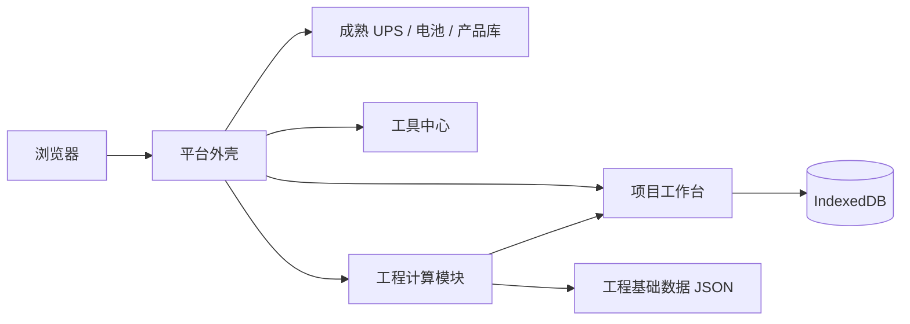

# v2 平台架构与数据边界

> 当前版本：v2.6.1 · 更新：2026-09-15

## 架构策略

平台采用渐进式模块化：成熟 UPS、电池、后备时间和产品数据库继续由 `index.html` 承载；Vite 入口 `src/main.js` 加载平台外壳和新工程模块。迁移遵守“先等价、后优化”，当前有效 Excel 仅作为核对源。



## 可见业务链

`项目信息 → 负荷计算 → UPS与电池 → 配电设备 → 电缆/铜排/母线 → 电能质量`

“编码与交付”自 v2.4.0 起暂时隐藏：不出现在侧栏、项目流程和工具中心；代码和项目字段暂留，待确认后恢复。模板中心继续作为资料治理入口。

## 模块边界

| 路径 | 责任 |
|---|---|
| `index.html` | 成熟功能、产品数据、产品数据库双表及导出兼容逻辑 |
| `src/main.js` | Vite 应用入口 |
| `src/platform/app-shell.js` | 平台导航、项目表单、工程视图、旧功能桥接 |
| `src/platform/project-schema.js` | 统一项目格式和归一化 |
| `src/platform/project-store.js` | IndexedDB、JSON 导入导出、旧数据复制迁移 |
| `src/platform/tool-registry.js` | 工具中心唯一入口、来源和治理状态 |
| `src/modules/engineering-calculators.js` | 无 DOM 的纯计算函数，包括锂电池 A00、铜排 A03 选型和铜排工程计算器 A00 热平衡反算 |
| `src/data/busbar-catalog.json` | 97 条铜排载流量数据 |
| `src/data/cable-catalog.json` | 224 条电缆基础数据 |
| `src/data/awg-catalog.json` | 50 条中美线规对照数据 |
| `src/css/platform-v2.css` | 平台、侧栏、工程模块和数据库视口布局 |

## 产品数据库布局

数据库视图使用从 `body.db-view-active` 到 `.db-table-scroll` 的完整高度链：

```text
viewport
└─ platform-layout (固定为顶栏以下高度)
   └─ platform-workspace (flex column, min-height:0)
      └─ container (flex, min-height:0)
         └─ data-table-panel (flex, min-height:0)
            └─ db-split-layout (flex, min-height:0)
               ├─ db-table-scroll (overflow:auto)
               └─ db-table-scroll (overflow:auto)
```

滚动只发生在上下两个表格容器，数据库视图隐藏页脚并禁止页面产生额外高度，因此不会出现大块底部空白，也不会截断最后一行。

## 本地数据

- IndexedDB `dc_electrical_platform_db`：项目和迁移元数据。
- IndexedDB `ups_data_db`：旧版 UPS 产品数据。
- localStorage：当前项目 ID、收藏、旧版兼容数据和界面偏好。
- sessionStorage `ups_auth`：当前前端访问状态。

迁移过程只复制，不删除旧键值。所有业务输入原则上一处填写、多模块引用。

## 公开构建边界

Vite 只从 `index.html` 和 `src/` 生成 `dist/`。`工具模板/`、原始 Excel、宏、供应商报价和项目文件不进入构建。商务成本仅保留空白价格格式；模板必须先检查隐藏工作表、VBA、外部链接、定义名称和价格残留。

## 验收门禁

1. Node 纯函数和入口测试。
2. Python 成熟功能全量回归。
3. `npm run test:build` 构建与公开内容审计。
4. 1366×768、1920×1080 和平板宽度浏览器回归。
5. 产品数据库双表能分别滚动到最后一行，控制台无 error。
6. 文档版本、应用版本和包版本一致。
7. 锂电池 Excel 示例（500kW、600kVA、512V、2组、PF0.8、0.25h、输出效率0.95）应得到 C2=160、F2=0.95、I2=4C、J2=3.05V、K2=141.909995Ah，页面整数显示 142Ah。
8. 铜排工程计算器 Excel 示例（120×10mm、105℃、房间35℃、内部温升15K、h=5、ε=0.35）应得到热平衡电流 2512.862393A，80%建议值 2010.289914A；同时保证 A03 按电流选型结果不变。
