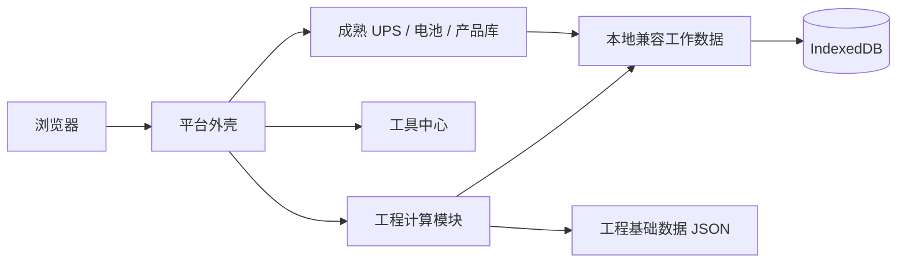

# v2 平台架构与数据边界

> 当前版本：v2.10.0 · 更新：2026-09-28 · 正式名称：UPS与配电选型助手

## 架构策略

平台采用渐进式模块化：成熟 UPS、电池、后备时间和产品数据库继续由 `index.html` 承载；Vite 入口 `src/main.js` 加载工具中心和新工程模块。正常用户入口只呈现独立专业工具，当前有效 Excel 仅作为公式与产品规则核对源。


```mermaid
flowchart LR
  Browser[浏览器] --> Shell[平台外壳]
  Shell --> Legacy[成熟 UPS / 电池 / 产品库]
  Shell --> Tools[工具中心]
  Shell --> Engineering[工程计算模块]
  Legacy --> WorkspaceData[本地兼容工作数据]
  Engineering --> WorkspaceData
  WorkspaceData --> IDB[(IndexedDB)]
  Engineering --> Data[工程基础数据 JSON]
```

## 可见业务链

`工具中心 → 选择独立专业工具 → 计算 / 配置 / 导出`

UPS 选型从本版起采用 `客户原文 → 工程师确认技术条件 → 纯函数硬条件校核 → 人工采用及偏离说明 → 方案快照/导出`。AI 只辅助提取和解释，不能覆盖纯函数的合格结论。目录元数据保存在本机 `ups_catalog_metadata_v1`，选型快照继续使用兼容的 `ups_selection_history`；无后台、不跨设备同步。单条快照与全量历史可导出/导入 JSON，目录需另行核对，不随备份覆盖。

“项目工作台”和“数据中心方案校核”自 v2.9.0 起不再作为用户入口；v2.9.1 继续取消简化的“负荷与配电”和“模板中心”入口。数据中心整案按项目定制，不由平台给出标准化整案结论。旧 schema、IndexedDB 数据、旧校核实现、负荷页和模板版本清单仅作兼容保留，避免破坏历史数据；“编码与交付”继续隐藏。

## 模块边界

| 路径 | 责任 |
|---|---|
| `index.html` | 成熟功能、产品数据、产品数据库双表及导出兼容逻辑 |
| `src/main.js` | Vite 应用入口 |
| `src/modules/ups-selection.js` | UPS 需求解析、产品归一化、硬条件校核、候选排序和目录差异计算；无 DOM、无价格 |
| `src/platform/app-shell.js` | 平台导航、工具中心、工程视图、本地兼容数据和旧功能桥接 |
| `src/platform/project-schema.js` | 统一项目格式和归一化 |
| `src/platform/project-store.js` | IndexedDB、JSON 导入导出、旧数据复制迁移 |
| `src/platform/tool-registry.js` | 工具中心唯一入口、来源和治理状态 |
| `src/modules/engineering-calculators.js` | 无 DOM 的纯计算函数，包括锂电池 A00、铜排选型/热平衡、智能母线 A/B 工况、逐柜支路、插接箱组合和 BOM |
| `src/data/busbar-catalog.json` | 97 条铜排载流量数据 |
| `src/data/cable-catalog.json` | 224 条电缆基础数据 |
| `src/data/awg-catalog.json` | 50 条中美线规对照数据 |
| `src/data/smart-busway-catalog.json` | 160～800A 智能母线槽、端口箱、已确认插接箱及无编码工程能力项的无价格目录 |
| `src/css/platform-v2.css` | 平台、侧栏、工程模块和数据库视口布局 |

## 产品数据库布局

数据库视图使用从 `body.db-view-active` 到 `.db-table-scroll` 的完整高度链：

```text
viewport
└─ platform-layout (固定为顶栏以下高度)
   └─ platform-workspace (flex column, min-height:0)
      └─ container (flex, min-height:0)
         └─ data-table-panel (flex, min-height:0)
            └─ db-split-layout (flex, min-height:0)
               ├─ db-table-scroll (overflow:auto)
               └─ db-table-scroll (overflow:auto)
```

滚动只发生在上下两个表格容器，数据库视图隐藏页脚并禁止页面产生额外高度，因此不会出现大块底部空白，也不会截断最后一行。

## 本地数据

- IndexedDB `dc_electrical_platform_db`：工具工作数据和迁移元数据；内部沿用旧项目字段名以兼容历史版本。
- IndexedDB `ups_data_db`：旧版 UPS 产品数据。
- localStorage：当前项目 ID、收藏、旧版兼容数据和界面偏好。
- sessionStorage `ups_auth`：当前前端访问状态。

迁移过程只复制，不删除旧键值。工作数据用于保存工具状态，不再对应可见的“项目工作台”。

### schema v2 与智能母线

- 当前项目 `schemaVersion=2`；智能母线设计保存在 `project.busbars.smartBuswayDesign`。
- `SmartBuswayDesign.version=3` 管理拓扑、安装方式、通道宽度、Kd/Ks/Kh、N 线选择、`quickConfig.rows[].profiles`、`runSelections`、方案级 `plugBoxStrategies`、两排布局和持久化 `plugBoxGroups`；项目级 `schemaVersion` 仍为 2，旧设计缺少新字段时自动补齐推荐策略。
- 计算输出以“排 × 路”的 `runs` 为当前接口，旧 `paths` 汇总继续作为兼容字段；`SmartBuswayPathResult` 同时保留推荐/采用母线档位、推荐/采用始端箱和风险状态。
- `plugBoxStrategies` 按“排 × 机柜类型 × 路径”保存生成布局前采用的插接箱电流、输出路数和备用数量；`PlugBoxGroup` 保存生成布局后的具体成员、回路、相别和型号状态。布局人工分组优先于方案策略，重新计算不会覆盖；结构错误只阻断插接箱条目，任一运行超过 800A 则阻断整份智能母线 BOM。
- 智能母线监控能力和始端箱防凝露属于产品默认功能，不作为独立 BOM；系统不再配置串口服务器。`terminalSmallScreen` 与 `monitorScreen10Inch` 分别控制始端箱小屏和每套母线10寸监控屏选配，旧 `touchscreen=true` 仅兼容迁移为10寸监控屏。
- 旧版智能母线结果只迁入 `project.legacy.smartBuswayV1`，不从汇总结果猜测机柜顺序、插接箱覆盖或相序。
- 项目负荷只用于首次预填，用户编辑布局后不会被负荷模块反向覆盖。

## 公开构建边界

Vite 只从 `index.html` 和 `src/` 生成 `dist/`。`工具模板/`、原始 Excel/DWG、宏、供应商报价和项目文件不进入构建。商务成本仅保留空白价格格式；模板必须先检查隐藏工作表、VBA、外部链接、定义名称和价格残留。智能母线目录不得包含任何价格字段。

## 验收门禁

1. Node 纯函数和入口测试。
2. Python 成熟功能全量回归。
3. `npm run test:build` 构建与公开内容审计。
4. 1366×768、1920×1080 和平板宽度浏览器回归。
5. 产品数据库双表能分别滚动到最后一行，控制台无 error。
6. 文档版本、应用版本和包版本一致。
7. 锂电池 Excel 示例（500kW、600kVA、512V、2组、PF0.8、0.25h、输出效率0.95）应得到 C2=160、F2=0.95、I2=4C、J2=3.05V、K2=141.909995Ah，页面整数显示 142Ah。
8. 铜排工程计算器继续保留原 Excel 示例（120×10mm、ε=0.35）的公式等价回归，同时以新亮镀锡复核示例（40×6mm、外部环境35℃、工程控制温升70K、柜内空气温升15K、h=5、ε=0.05、ρ₂₀=1.7241×10⁻⁸Ω·m）验证：热平衡电流 538.487764A、80%建议值 430.790211A、与 DIN 裸排 528A 的差异约 1.99%。A03 按电流选型只保留裸排/涂层数据列选择，不再把热缩套管等同于涂层列。
9. 智能母线覆盖 159/160/161A、630/631A、799/800/801A、空值/零值、单/双路、A-only/B-only、不对称两排、多容量类型、按排×路径选型、推荐/人工采用值、方案级插接箱策略、备用数量、单相三路、32A三相三路、40A三相两路/三路待确认、50A/63A三相两路、布局人工分组优先、重复/缺失分组、保存迁移和 BOM 阻断；浏览器同时检查方案配置、SVG 桌面/窄屏、分组编辑器、只读运行校核、整排立面、冷通道剖面及 PNG/PDF/Excel 输出。
